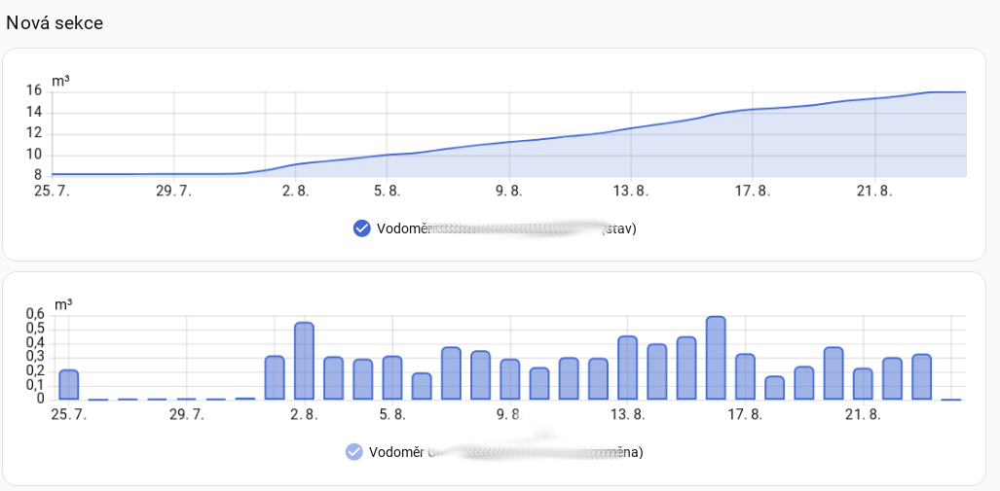
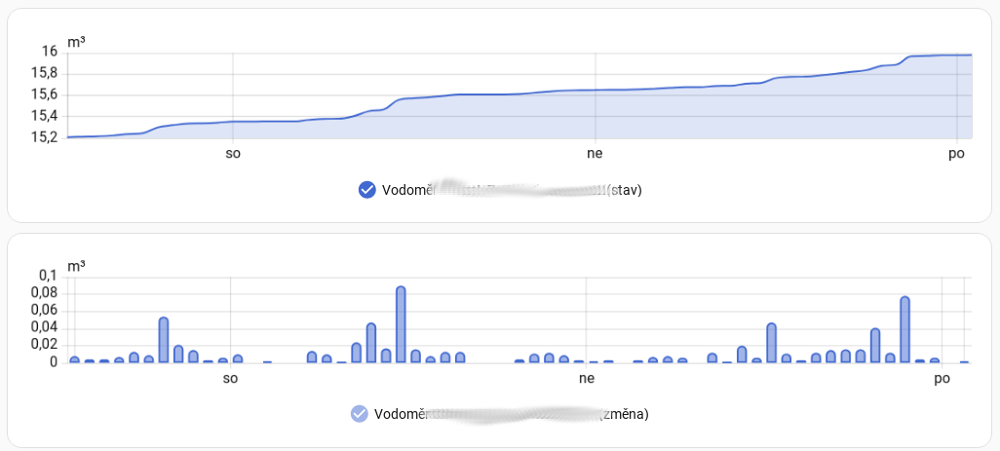

# VS Chrudim – Home Assistant

Home Assistant custom integration for the customer portal of **Vodárenská společnost Chrudim** (`zakaznik.vschrudim.cz`).

The integration logs in to the VS Chrudim customer portal, discovers all active consumption places belonging to the account, downloads the available meter-reading data and exposes the latest water-meter reading in Home Assistant.

> **Independent community integration**
>
> This project is not an official product of Vodárenská společnost Chrudim. It uses the current behaviour of the customer portal and may require updates if the portal changes.

## Features

- setup through the Home Assistant UI (Config Flow)
- e-mail + password authentication
- automatic discovery of all active consumption places belonging to the account
- one Home Assistant device per active consumption place
- current cumulative water-meter reading in m³
- timestamp of the latest reading available from VS Chrudim
- historical hourly readings imported into Home Assistant long-term statistics
- catches up multiple historical readings when the portal uploads a batch of data
- configurable polling interval from 1 to 24 hours
- reauthentication when the portal rejects the stored password
- reconfiguration without removing the integration
- Czech and English UI text

## Screenshots

### Adding the integration

### Water consumption data in Home Assistant

### Water consumption data in Home Assistant

## Installation

### HACS

The recommended installation method is HACS.

1. Open **HACS** in Home Assistant.
2. Search for **VS Chrudim (vodoměr)**.
3. Select the integration and click **Download**.
4. Restart Home Assistant.
5. Go to **Settings → Devices & services → Add integration**.
6. Search for **VS Chrudim**.
7. Enter the same e-mail address and password you use for the VS Chrudim customer portal.

If the repository has not yet appeared in the normal HACS search, it can be added temporarily as a custom repository:

1. Open **HACS**.
2. Open the three-dot menu in the upper-right corner.
3. Select **Custom repositories**.
4. Add the GitHub repository.
5. Select **Integration** as the category.
6. Add the repository and install the integration.

### Manual installation

Copy the contents of `custom_components/vschrudim/` into `/config/custom_components/vschrudim/`.

Then restart Home Assistant and add the integration through **Settings → Devices & services → Add integration**.

## Configuration

The integration requires the credentials used for the VS Chrudim customer portal:

- **E-mail**
- **Password**

After successful authentication, the integration automatically finds the active consumption places available to the account.

The polling interval can be changed later through the integration options. It can be set from **1 to 24 hours**; the default is **1 hour**.

## Devices and entities

For every active consumption place, the integration creates a Home Assistant device.

The device provides:

- **Stav vodoměru** – current cumulative water-meter reading in m³
- **Čas posledního odečtu** – timestamp of the reading

The meter sensor uses Home Assistant's `total_increasing` state class, allowing Home Assistant to calculate consumption statistics from the cumulative meter value.

The device also exposes identifiers supplied by the VS Chrudim portal, such as the registration number, technical number, address and meter identifier.

## Historical data

The VS Chrudim portal can sometimes make many hourly readings available at once. The integration therefore does **not** assume that one polling cycle produces exactly one new reading.

During every successful poll, the integration downloads the available CSV data and compares its timestamps with the historical statistics already imported for each consumption place.

For example, if the portal suddenly provides 24 new hourly readings, the integration imports all 24 readings with their original timestamps.

This allows Home Assistant to retain the actual hourly consumption curve even when the portal was contacted only once during that period.

The current sensor state always represents the latest reading available from the portal. A separate timestamp sensor shows the time to which that reading applies.

### Historical statistic ID

Imported historical data uses a separate Home Assistant statistic ID:

`vschrudim:<consumption_place_id>`

The built-in Home Assistant statistics graphs can use this history directly.

Cards that rely on normal entity history may only display the period during which the entity itself existed.

### Statistic graph example

`<YAML>
type: statistics-graph
grid_options:
  columns: 24
  rows: 3
entities:
  - vschrudim:604202_7530
days_to_show: 3
period: hour
chart_type: bar-stack
stat_types:
  - change`

## Polling

The default polling interval is **1 hour** and can be changed from **1 to 24 hours**.

Polling controls how often Home Assistant checks the VS Chrudim portal. It does **not** mean that the portal necessarily publishes a new reading at every poll.

If the portal has accumulated several readings since the previous poll, the integration processes all available historical readings.

## Reauthentication and reconfiguration

If the portal rejects the stored password, Home Assistant can request reauthentication without removing the integration.

The integration also supports reconfiguration, allowing the stored account information to be changed without deleting the existing integration entry.

## Troubleshooting

If the integration stops updating or authentication fails:

1. Check that the VS Chrudim customer portal is accessible.
2. Verify the e-mail address and password.
3. Check the integration's last update/error information in Home Assistant.
4. Enable debug logging and reproduce the problem.

To enable debug logging:

**Settings → Devices & services → VS Chrudim → ⋮ → Enable debug logging**

Alternatively:

    logger:
      logs:
        custom_components.vschrudim: debug

Then reproduce the problem and download the captured log.

**Never post your password, session cookies, exported personal data or real consumption-place details in a GitHub issue or pull request.**

## Known limitations

- The integration depends on the current behaviour and HTML/CSV format of the VS Chrudim customer portal.
- The portal may change without notice, which can require an update to the integration.
- Historical statistics are imported using Home Assistant's statistics mechanism; normal entity history and long-term statistics have different lifecycles in Home Assistant.

## Privacy

The integration communicates with the VS Chrudim customer portal using the credentials supplied during setup.

No credentials or portal data are intentionally sent to this GitHub repository or to a third-party service operated by this project.

When reporting an issue, remove credentials, session cookies and personal consumption-place information from logs and screenshots.

## Removing the integration

Go to **Settings → Devices & services**, open **VS Chrudim**, choose the three-dot menu and select **Delete**.

Removing the integration stops polling and removes its Home Assistant config entry. Home Assistant's recorder database and existing historical statistics are managed by Home Assistant itself.

## Development

The repository contains automated tests and GitHub Actions for:

- HACS validation
- Home Assistant Hassfest validation
- Config Flow tests

The automated tests do not access the live VS Chrudim portal. Network responses are mocked.

The project currently targets the Home Assistant **Bronze** quality scale.

## License

This project is licensed under the terms of the included [LICENSE](LICENSE) file.

## Disclaimer

This is an independent community integration and is not affiliated with or endorsed by Vodárenská společnost Chrudim.

The integration relies on the current behaviour of the VS Chrudim customer portal. Changes to that portal may cause the integration to stop working until the integration is updated.
